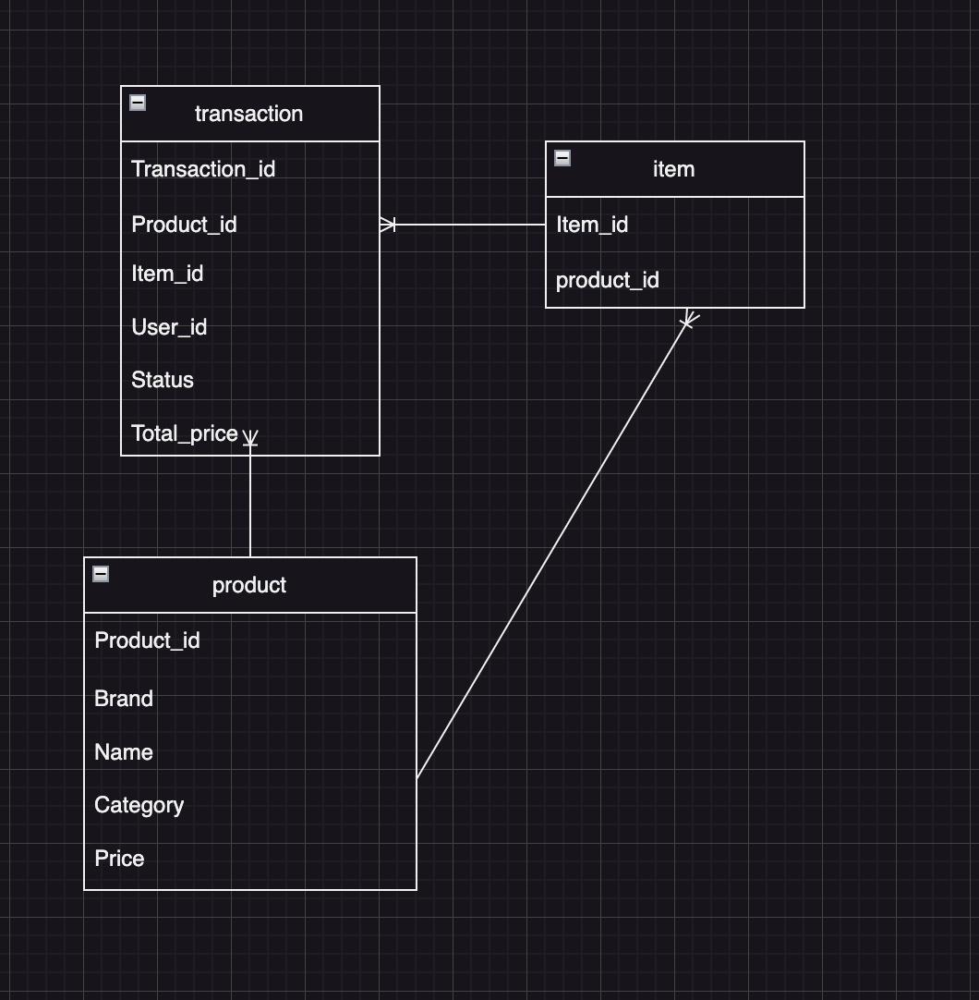
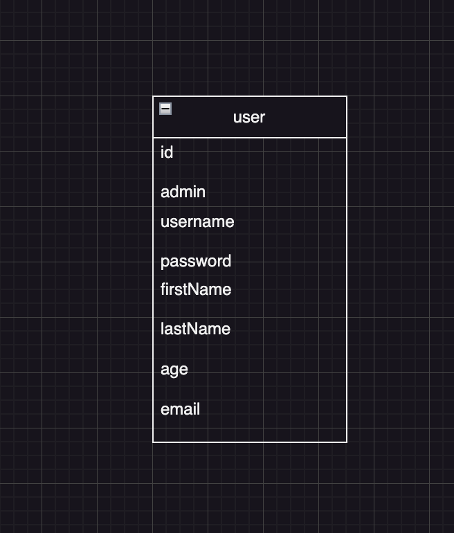

# Nunamarket using MSSQL, Neo4j & MongoDB
## Table of contents
- [Step 1](#step-1)
  - [Folder structure:](#folder-structure)
- [Step 2](#step-2)
  - [Project solution:](#Project-resume)
  - [Database diagrams:](#Database-diagrams)
  - [Argumentation of Choices:](#argumentation-of-choices)
- [Step 3](#step-3)
  - [Further development/improvements](#further-developmentimprovements)

# Step 1
## Folder structure:
📁data --> all data including csv and json files for NEO4j, MSSQL & MongoDB

📁serverclient --> our NunaMarket application using next.js (Application code) readme on how to run in, inside the folder

📁Neo4j --> scripts for Neo4j

📁MSSQL --> scripts for Mssql

📁MongoDB --> scripts for MongoDB

# Step 2
## Project solution:

## Database diagrams
diagrams

# Step 3
## Further development/improvements

