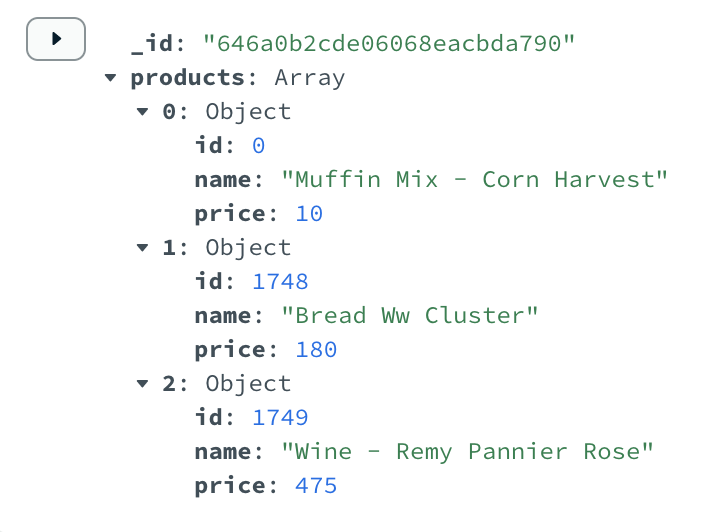
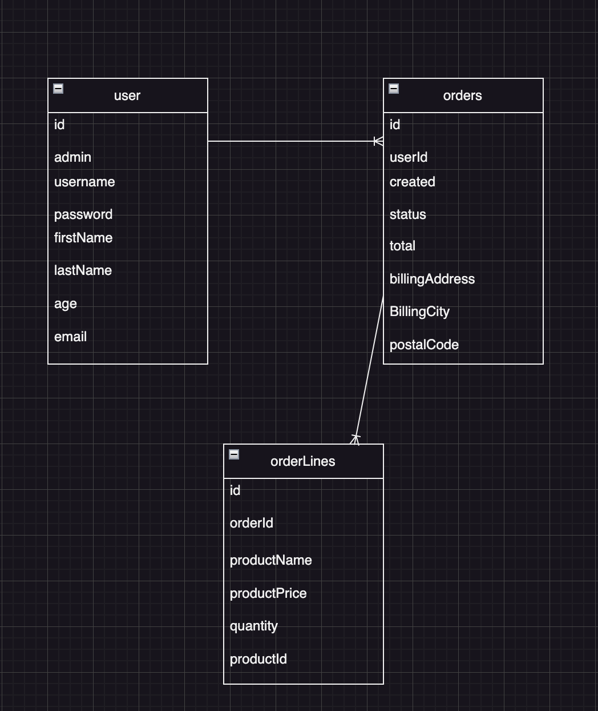

# Nunamarket using MSSQL, Neo4j & MongoDB
Group:
Markus Agnsgaard - cph-ma587@cphbusiness.dk
Rasmus Dalgaard - cph-rd92@cphbusiness.dk
Thomas Amorsen - cph-tha181@business.dk
## Table of contents
- [Step 1](#step-1)
  - [Folder structure:](#folder-structure)
- [Step 2](#step-2)
  - [Project solution & Argumentation of Choices:](#Project-resume)
  - [Database diagrams:](#Database-diagrams)
- [Step 3](#step-3)
 - [Use cases:](#Use-cases)

# Step 1
## Folder structure:
📁data --> all data including csv and json files for NEO4j, MSSQL & MongoDB

📁serverclient --> our NunaMarket application using next.js (Application code) readme on how to run in, inside the folder

📁mongo --> Sharded cluster in a docker-compose file --> readme file on how to setup

📁Scripts --> contains all scripts
-      📁Neo4j --> scripts for Neo4j
-      📁MSSQL --> scripts for Mssql
-      📁MongoDB --> scripts for MongoDB

# Step 2
## Project solution:
We have in our project made a retail store, where you as a user can buy products.

MongoDB
We've used MongoDB for our Cart system:
The reason why is because it excels at handling flexible and unstructured data. it makes sense because the cart is likely to have a dynamic structure that can vary from one customer to another. MongoDB also allows us to store shopping cart data as JSON documents, providing the flexibility to add or remove products easily. Furthermore MongoDB is really good at handling large amounts of data and its scalability make it suitable for storing shopping cart information, if our store was to grow even bigger and expand.

Neo4j
We've used Neo4j to handle our product catalog and reviews to each product
the reason we choose neo4j for this is because it is good to handle highly connected data and relationships. Using Neo4j for our product catalog and reviews makes sense because it allows us to represent the complex relationships between products, such as categorizations, variations, and recommendations and at the sametime we used a Similiairty algoritm. Using Neo4j, we are able to  create nodes to represent products and connect them with relationships to product reviews, related products. Neo4j is suitable for providing personalized product recommendations and analyzing relationships within your catalog for even further improvements and work.

MSSQL
We've used MSSQL to handle our users, orders and orderlines
MSSQL uses a rigid schema, ensuring data consistency and integrity. This means that we are able to define the structure of our user table to store customer details such as names andaddresses. The predefined schema ensures that data is stored accurately and uniformly, which is essential for maintaining the integrity of user related information.
At the same time MSSQL allows us to establish relationships between different tables, making it ideal for managing order related data. By using tables such as orders and order lines, we can capture order specific information such as order IDs, timestamps, and the products purchased.
## Database diagrams
diagrams

# Step 3
## Use cases
Customer
As a Customer, I want to buy Products
As a Customer, I want to see my Orders
As a Customer, I want to view reviews on a product
As a Customer, I want to get recommendations for other Products based on the Product Category of the Product I am currently looking at.
As a Customer, i want to add a product to my cart
As a Customer, I want to see my personal information (Username, Password, Email, Firstname, Last Name, Age)

